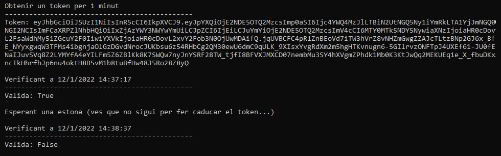

# Exemple de creació i verificació de tokens amb RSA i C# (Net6)

En executar el main crea un token que és vàlid durant un minut i el verifica:



## RSA

Fa servir RSA (private.pem i public.pem).

Per generar-ne de noves només cal fer servir **OpenSSL** per generar la clau secreta (el nom dels arxius és opcional)

```console
openssl genrsa -out private.pem 2048
```

I extreure la clau pública del arxiu generat en l'anterior pas:

```console
openssl -rsa -in private.pem -pubout -out public.pem
```
